# バトルエフェクト強化案プレビュー（Before / After）

ゲーム本体のコードは変更せずに、バトル中のエフェクト強化案を確認するための **スタンドアロンのプレビュー** です。
オーナーが方向性を決めたあと、別タスクで本実装します。

| ファイル | 内容 |
| --- | --- |
| `index.html` | プレビューページ。全シーンの BEFORE / AFTER を並べて再生する |
| `preview.js` | シーンの組み立て。BEFORE は `MoveMotionOverlay.tsx` / `BattlePanel.tsx` のインラインスタイルを同じ値で再現 |
| `after.css` | **強化案の本体**（`fx-` 接頭辞の keyframes / クラス）。本実装時に移植する部分 |
| `preview.css` | プレビューページ自体のレイアウト（提案とは無関係） |
| `assets/*.svg` | プレビュー用のラクガキキャラ 2 体 |
| `img/*-frames.jpg` | 連続フレーム（上段 = 現行、下段 = 提案） |
| `img/*.gif` | 実時間の GIF（左 = 現行、右 = 提案） |

## 見かた

ビルドは不要です。BEFORE は本番の `frontend/src/app/globals.css` を相対パスで直接読み込むため、リポジトリのルートを配信してください。

```bash
# リポジトリのルートで
npx serve .        # または python3 -m http.server
# → http://localhost:3000/docs/effects-preview/ を開く
```

- 「▶ もう一度」でシーンごとに再生、「くりかえし再生」で自動ループします。
- `?reduced=1` を付けると、`prefers-reduced-motion: reduce` のときの見え方になります。
- `?capture=1&scene=attack&variant=after` で 1 ステージだけを表示します（撮影用）。
- `globals.css` 先頭の `@import "tailwindcss"` はブラウザでは解決できず 404 になりますが、影響はありません。

### 画像の撮り方

Playwright で `?capture=1` のページを開き、`document.getAnimations()` をすべて一時停止して `currentTime` を指定時刻に合わせてから撮影しています（コマ落ちのない確定的なフレーム）。
GIF は 50ms 間隔のフレームを Pillow で結合し、gifsicle（`-O3 --lossy=40`）で軽量化しました。撮影時は、比較しやすいように待機モーション（`doodleIdleFloat` / `groundShadowBreath`）だけ 0ms に固定しています。

## 現状の把握（BEFORE）

| 項目 | 現状 | 課題 |
| --- | --- | --- |
| ヒットのタイミング | `BattlePanel.tsx` の `runPhase` で、フェーズ開始と同時に `hitIds` / `impactEffects`（`comic-burst`・`impactParticles`）/ ダメージ数字 / 画面揺れを出している | こうげきの踏み込みが届く（`attackLunge` の 50% ≒ 360ms）前や、まほう弾が届く（0.3s 遅延 + 飛翔）前に「バシッ!」が出る。**当たった瞬間**が伝わらない |
| こうげき | `attackLunge`（0.72s）+ `AttackTrailEffect`（横長の細い線 72px） | 軌跡が線 1 本で、斬撃・打撃に見えにくい。ため・ヒットストップがない |
| バリア | `BarrierWallEffect`（幅 12px の縦の光の棒）。割れは `scaleY` で縮むだけ。衝突は棒が 50px ずつ動くだけ | 「壁を張った」「割れた」「ぶつかった」が読み取りにくい。光の棒は SF 寄りでラクガキの世界観と離れている |
| まほう | `MagicBullet` は弱・強とも同じ紫のグラデーション（サイズ 24px / 36px の差のみ）。`MagicRuneEffect` も円の大きさの差のみ | 弱まほう = 青（ACTION_COLORS）と合っていない。強まほうの「ため」と「着弾の爆発」がない |
| 反射 | `barrierReflect` で弾が同じ直線上を行って戻る | 跳ね返ったことが分かりにくい |
| バリアでダメージ（vs チャージ / vs まひ） | `battleLogic.ts` の `barrierCollisionDamage` でダメージが入るが、`battleAnimationPhases.ts` の `defaultMotionForAction` により通常の `barrierWall`（その場に棒を張るだけ）。相手側はフェーズ開始と同時に「バシッ!」が出る | バリアが **相手に当たった** ように見えず、なぜダメージを受けたのか分かりにくい |
| まひ（行動不能） | 行動欄に灰色の「まひ」ラベル（`ACTION_COLORS.paralysis`）が出るだけで、キャラ自体には演出なし（モーション `none`） | しびれて動けない状態がキャラから伝わらない |
| チャージ | `chargeConcentration` + `ChargeAuraEffect`（黄色の楕円）+ 黄色いグロー | 行動色（緑）と不一致。通常バトルでは段階差がない（overcharged の見た目は協力モードの青いグローのみ） |
| パフォーマンス | `hitFlash` / `chargeGlowPortrait` / `magicPortraitGlow` / `barrierBreak` が `filter` を、`chargeGlow` が `box-shadow` をアニメーションしている | どちらもコンポジタで処理できず、低スペック端末で毎フレーム再描画になる |

## 強化案（AFTER）

デザイン方針: クレヨン / マーカーで描いたような **インクの縁取り（#14161f）+ 行動色の塗り + 斜線のムラ**、ギザギザのバースト、マンガの集中線、描き文字の擬音。SF のビームのような発光表現は使わず、キャラ（プレイヤーの絵）より目立ちすぎない大きさに抑えます。

### 共通の仕組み

- **ヒットの瞬間をそろえる**: ステージに `--hit`（ms）を渡し、バースト・火花・擬音・白フラッシュ・ダメージ数字・画面揺れを `animation-delay: var(--hit)` で同時に出す。
- **ヒットストップ**: こうげき側の keyframes に「同じ姿勢のまま止まる区間」（通常 30〜40% ≒ 85ms、チャージ中 30〜46% ≒ 135ms）を入れ、被弾側も同じ時間「くの字」で止める。
- **白フラッシュ**: 画像の複製に静的な `filter: brightness(0) invert(1)` をかけた白シルエットを重ね、`opacity` だけを点滅させる（`filter` はアニメーションしない）。
- **ダメージ数字**: 着弾点から飛び出し、1.5 倍まで膨らんでから傾いて止まる。行動色のずらし影（こうげき = 赤、弱まほう = 青、強まほう = 紫）。

### 1 アクションあたりの演出時間の目安

フェーズ間隔（`TURN_PHASE_INTERVAL_MS = 850`）の中に収めます。ダメージ数字だけは現行どおり次のフェーズにまたがって消えてよいものとします。

| アクション | 全体 | ヒットの瞬間 |
| --- | --- | --- |
| こうげき（通常 / チャージ中） | 850ms | 255ms（ため 0〜190ms → 突進 → ヒットストップ 85 / 135ms） |
| バリア展開 | 750ms | 展開完了 ≒ 220ms |
| バリア割れ | 850ms | 接触 255ms → 割れ 357ms |
| バリア衝突 | 750ms | 230ms |
| まほう反射 | 850ms | 壁に当たる 340ms → 術者に当たる 612ms |
| 弱まほう | 850ms | 442ms |
| 強まほう | 850ms | ため 0〜340ms → 着弾 510ms |
| バリアをぶつける（vs チャージ / vs まひ） | 850ms | 壁を張る 0〜120ms → ため 200ms → 押し出し → 当たる 300ms（ヒットストップ 〜400ms） |
| まひ（行動不能） | 850ms（フェーズ中ループ） | なし（稲妻 300ms 周期・震え 400ms 周期で点滅し続ける） |
| チャージ | 800ms | 脈動 2 回（270ms / 470ms）。以降は軽い待機オーラのループ |

### こうげき

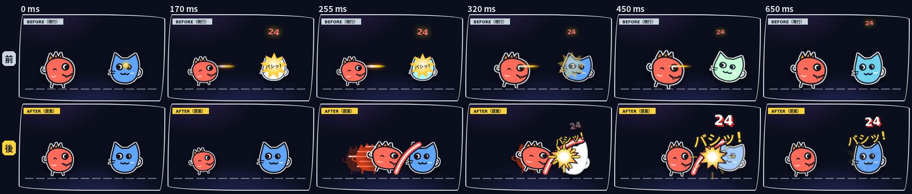
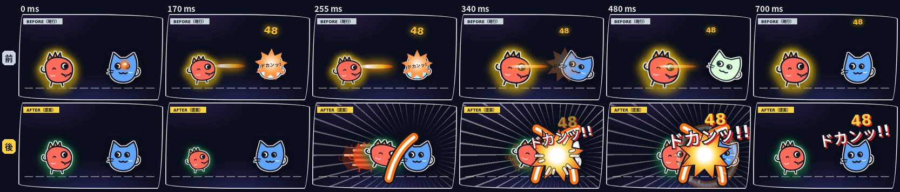

- **何をどう変えるか**: ため（後ろに沈む）→ 突進（赤い残像 2 体 + 白いスピード線）→ ヒットストップ → 赤いクレヨンの斬撃の弧 + 黄色いギザギザのバースト + 火花 +「バシッ!」→ 被弾側がふっとぶ。
- **チャージ中**: ためが深く、ヒットストップが長い。残像 3 体、オレンジの X 字の斬撃、衝撃波のリング、画面全体の集中線、「ドカンッ!!」、画面揺れを大きく（6px）。

### バリア

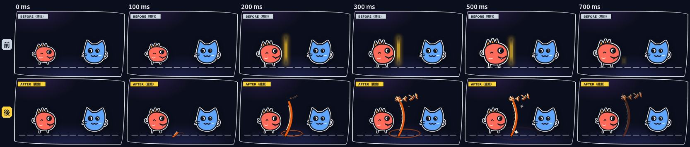
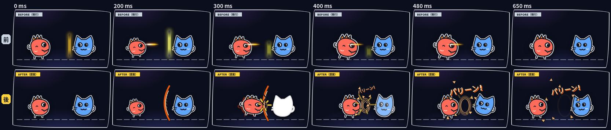
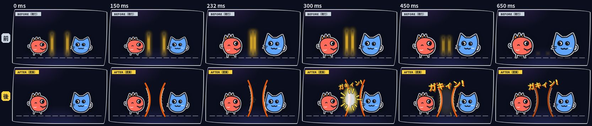
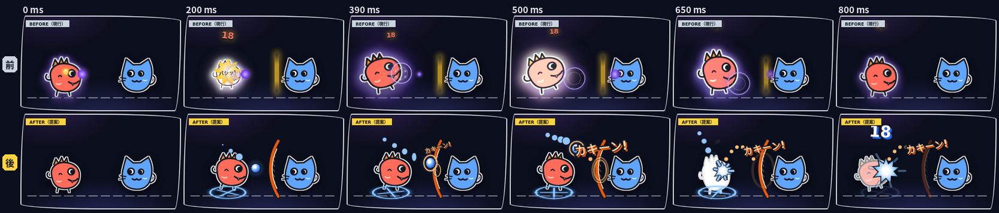
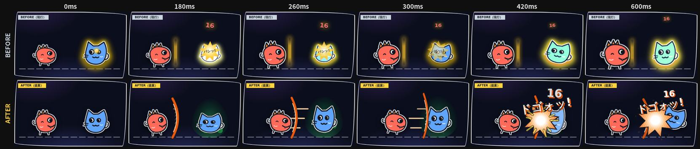
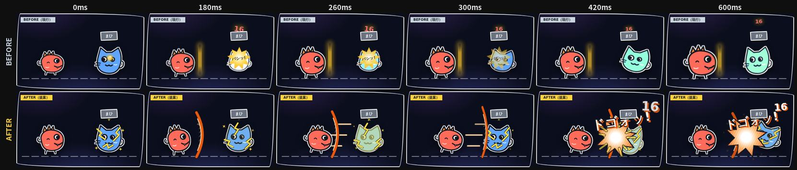

- **展開**: オレンジのマーカーで描いた弓なりの二重線の壁が、地面から線を描くように伸びる（`stroke-dashoffset`）。中は斜線のハッチング、足元に波紋、上下に ✦ のきらめき、「キィン!」。
- **割れる**: 当たった点から波紋 3 重 + ヒビが走り、壁が震えたあと、破片 8 枚が回転しながら放物線を描いて飛び散る。「パリーン!」。
- **衝突**: 両者の壁が押し出して中央でぶつかり、ヒットストップ → 押し戻される。中央に白い閃光と黄色い火花、「ガキィン!」、小さな画面揺れ。
- **バリアをぶつける（バリアでダメージを与えるとき）**: 「バリア vs チャージ」「バリア vs まひ」のように、バリア側がダメージを与える場合は、張った壁を **相手に叩きつける**。壁を張る → 少し手前に引いてためる → 本人も前に踏み込みながら壁を押し出す（スピード線）→ 相手の体に当たって壁が横につぶれる（ヒットストップ）→ 反動で戻りながら消える。当たった瞬間にオレンジのバースト + 火花 +「ドゴォッ!」+ ふっとび + 軽い画面揺れ。vs チャージでは、溜めていた緑の炎がヒットの瞬間にしぼんで消える（チャージを潰されたことが分かる）。
- **反射**: 弾が壁に当たると壁がたわみ、「カキーン!」。弾はオレンジの縁取りに変わって **山なりの軌道** で戻り、オレンジの点線で「跳ね返った道すじ」を残す。

### まほう

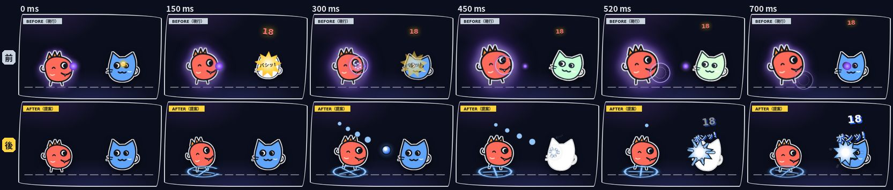
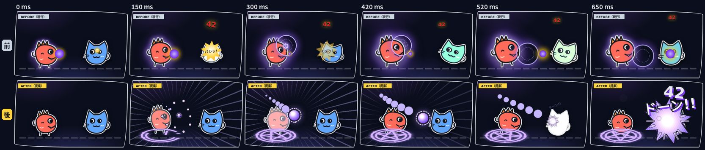

- **弱まほう（青）**: 足元に小さな魔法陣（十字）。インクの縁取りの青い弾 + 点線のような尾。着弾で小さな青いバースト、「ポンッ!」。
- **強まほう（紫）**: 浮き上がって溜める時間（約 340ms）。大きな二重円 + 星の魔法陣を描き、粒子が手元へ収束し、弾がふくらむ。紫の集中線。長い尾を引いて飛び、着弾で大きなバースト + 衝撃波 + 煙 3 つ +「ドーン!!」+ 画面揺れ。

### チャージ

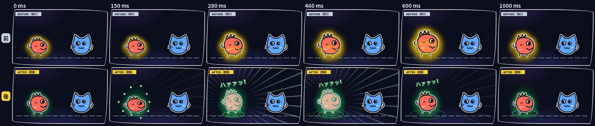
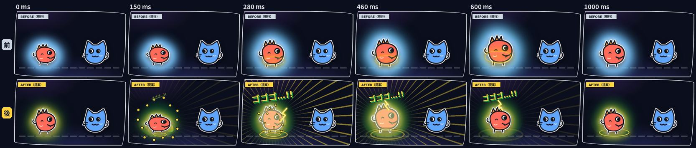

- **charged（緑）**: 沈み込み → 2 回の脈動。足元から緑の炎が立ちのぼり、粒子が体に収束、緑の集中線、体が緑に光る（シルエットの `opacity`）、地面の波紋 2 回、「ハァァッ!」。終わったあとは足元に軽い楕円オーラが残る。
- **overcharged（緑 + 金）**: 炎を大きく・多く（11 本）、金色の先端、稲妻、細かい震え、わずかな地鳴り（1.5px）、「ゴゴゴ…!!」。待機オーラも金色に。

### まひ（行動不能）

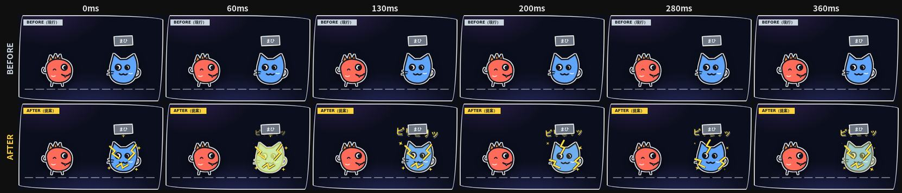

- 体の上に **黄色いギザギザの稲妻（インクの縁取り）** を 2 組描き、300ms 周期で交互に点滅させて電気が走っているように見せる。
- キャラはその場で 2〜3px だけ小刻みにガタガタ震える（`steps(1)` の `transform`）。前後には動かない＝「動けない」。
- 体が黄色くチカチカ光る（黄色いシルエットの `opacity` の明滅）、まわりに小さな星形の火花、頭の上で描き文字「ビリビリッ」も震える。行動欄の灰色「まひ」ラベルはそのまま残す。
- まひ中にバリアをぶつけられたときは、稲妻・震えを続けたまま被弾リアクションを重ねる（上の「バリアをぶつける（vs まひ）」）。

### 共通（既存演出との統一感）

- 勝ち・ダメージ・回避・まひも同じ部品（インクの縁取り、描き文字、ギザギザのバースト、ずらし影）でそろえる。例: 回避は青いスピード線 +「ヒョイッ」。まひは上の「まひ（行動不能）」の稲妻 +「ビリビリッ」。
- 既存の `comic-burst` / `damageStickerPop` / `sticker-text` の見た目はそのまま発展させる方向。

## 実装時に変更するファイル

| ファイル | 変更内容 |
| --- | --- |
| `frontend/src/app/globals.css`（または新規 `battle-effects.css` を `globals.css` から読み込む） | `after.css` の keyframes / クラスを移植。既存の `attackTrail` / `barrierWall` / `barrierBreak` / `barrierClash` / `chargeAura` などは置き換え。`prefers-reduced-motion` のブロックに新しいクラスを追加 |
| `frontend/src/components/Battle/MoveMotionOverlay.tsx` | `AttackTrailEffect` → SVG の斬撃（`AttackSlashEffect`）+ 残像（`AttackGhosts`）。`BarrierWallEffect` → SVG の壁 + 波紋 / ヒビ / 破片。`MagicBullet` → `sourceActionType` で色を分け、尾を追加。`MagicRuneEffect` → SVG の魔法陣。`ChargeAuraEffect` → 炎 / 収束粒子 / 段階（charged / overcharged）。新規 `BarrierBashEffect`（押し出して叩きつける壁）、`ParalysisStunEffect`（体の上の稲妻 SVG + 火花 + 「ビリビリッ」）。新規 `ImpactEffect`（バースト + 火花 + 擬音）、`FocusLines` |
| `frontend/src/components/Battle/BattlePanel.tsx` | ① アリーナ全体に重ねる `BattleFxLayer` を追加（弾の飛翔・反射の軌道・衝突の中心・集中線など、キャラをまたぐ演出用）。② `runPhase` で、`hitIds` / `impactEffects` / ダメージ数字 / 画面揺れを **フェーズ開始ではなくヒットの瞬間** に出す（`schedule` で遅らせる）。③ 白フラッシュ用のシルエット画像を `portrait-hit-filter` の中に追加し、`hitFlash`（filter アニメーション）を置き換え |
| `frontend/src/components/Battle/battleAnimationPhases.ts` | `TurnAnimationPhase` に `impactDelayMs`（または `getImpactTiming(motionType, sourceActionType, chargeMultiplier)`）を追加。反射時のバリア側を区別する `MoveMotionType` の `"barrierReflect"` を追加。バリアでダメージを与えるとき（相手がチャージ / まひ）用に `"barrierBash"` を追加し、`getTurnAnimationPhases` で「バリア vs チャージ」「バリア vs まひ」の組み合わせをバリア側 `barrierBash`、まひ側 `"paralysisStun"`（新規）に割り当てる（チャージ側は `chargeConcentration` のまま）。チャージ段階を表す `motionIntensity: "normal" \| "charged" \| "overcharged"` を追加（`coopRoguelike.ts` の段階判定を通常バトルにも使う） |
| テスト | `MoveMotionOverlay.test.ts`（アニメーション名・方向）、`battleAnimationPhases.test.ts`（ヒット時刻・新しいモーション種別。バリア vs チャージ / まひ → `barrierBash`、まひ → `paralysisStun`）、`BattlePanel.test.ts`（ヒット演出の遅延）を更新・追加 |

## パフォーマンスとアクセシビリティ

- アニメーションするのは **`transform`（`translate` / `rotate` / `scale`）と `opacity` だけ** を基本にする。`filter` / `box-shadow` は静的に指定し、光る・点滅するものは「静的な filter をかけた複製」の `opacity` で表現する。
- 例外は SVG の線を描く `stroke-dashoffset`。要素が小さく 90〜220ms と短いので、コストは小さい。
- 要素数の上限の目安: 1 アクションあたり DOM 30 個前後（火花 6〜12、破片 8、炎 7〜11、粒子 10〜14）。演出が終わったら DOM から外す（現行の `IMPACT_EFFECT_DURATION_MS` と同じ仕組み）。
- 集中線は `repeating-conic-gradient` + `mask` の静的な 1 枚を `opacity` / `scale` で出し入れするだけ。
- 低スペック端末向けに、`navigator.hardwareConcurrency` や設定画面の「演出: 軽量」で、残像 / 集中線 / 煙 / 破片の数を減らせるようにする（`data-fx-quality="low"` などのクラスで CSS 側から非表示にする）。
- `prefers-reduced-motion: reduce` では、画面揺れ・残像・スピード線・集中線・粒子・破片・炎を止め、キャラの大きな移動もなくす。「何が起きたか」を伝える **描き文字 / バースト / ダメージ数字** だけを短く残す（`after.css` 末尾、`?reduced=1` で確認可）。
- ターン制の読み合いを優先し、バーストは被弾側のキャラを長く隠さない大きさ（通常 92px、ピーク約 400ms）に抑える。

## 段階的な実装計画

1. **共通基盤 + こうげき**: `--hit` によるヒットタイミング同期（`battleAnimationPhases.ts` と `BattlePanel.tsx`）、白シルエットのフラッシュ、新しいダメージ数字、`ImpactEffect`、斬撃 / 残像 / スピード線、ヒットストップ。ここで reduced-motion と軽量モードの仕組みも作る。
2. **バリア**: SVG の壁（展開 / 割れ / 衝突 / ぶつける）、波紋、破片。`"barrierBash"` と `"paralysisStun"`（まひの稲妻）もここで入れる。`BattleFxLayer` を導入して衝突の中心に火花を出す。
3. **まほう**: 弱・強の色分け、魔法陣、尾、強まほうのため・収束・爆発・煙。反射の山なり軌道と点線（`"barrierReflect"` の追加）。
4. **チャージ**: 炎 / 収束粒子 / 脈動、charged / overcharged の段階差、待機オーラ（既存の `chargeGlowPortrait` の置き換え）。
5. **画面全体の演出と統一**: 集中線、画面揺れの強さの整理、回避・勝ちの演出を同じ部品でそろえる。最終ボス（`final-boss-*`）の演出との重なりを調整。
